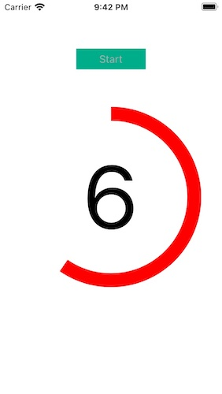

# TomatoCountdown Framework

<h2>Development and compatibility</h2>

Development platform: iOS 
Language: Swift 
Compatibility: iOS 11 or greater 

<h2>Description</h2>

TomatoCountdown lets you create a countdown timer with a one-color circular ring.  The following is a list of features.

<ol>
<li>Set the position in degree where a circular ring starts.</li>
<li>Set the size, the weight and the color of a circular ring.</li>
<li>Have options of including or not including a speech (Engllish only) counting down numbers.</li>
<li>Set an English local for a speech voice.</li>
<li>Adjust the speed of speech.</li>
<li>Tap the number to let the user stop and quit counting down numbers.</li>
<li>Set the font of a UILabel object for showing countdown numbers.</li>
</ol>

<h2>Installation</h2>

1. In order to use this framework, download the sample project.  You will find the folder titled 'TomatoCountdown.'  Locate the Xcode file inside.  And put this Xcode file in your Xcode project.  Select your target and make sure you have 'TomatoCountdown.framework' under General > Framworks, Libraries, and Embeded Content as shown below.

2. In your view controller, import two frameworks, **AVFoundation** and **TomatoCountdown**.  When the user aborts the countdown or reaches the end of countdown, you will receive a delegate call.  So set **TomatoCircleViewDelegate** in the view controller class.

3. Create an **AVSpeechSynthesizer** object.  And make a silent speech in your viewDidLoad.  (See the sample project.)  If you don't, whenever your app first count down numbers with audio, it will stutter.

4. When you are ready to count down numbers, instantiate **TomatoCircleView** with the initial values.  Set its delegate.  Finally, call **createProgress**.

<h2>Init</h2>

<li>hasSpeech: A boolean value for whether or not to include a speech in counting down numbers to zero</li>
<li>enLan: English locale for speech</li>
<li>utterRate: Speech speed.  Set it to around 0.5.</li>
<li>hasZero: If you set it to true, your app will audio-count down numbers to zero.  Or it will audio-count down numbers to 1.</li>
<li>startDegree: Tell the framework where the circle starts.  If you want to start it at 0 o'clock, set it to -90.</li>
<li>radius: It's the radius of the circle.</li>
<li>strokeColor: It's the stroke color of the circle.</li>
<li>weight: It's the stroke size of the circle.</li>
<li>labelFont: It's the font of the UILabel object that counts down numbers.</li>
<li>num: It's the starting number.</li>
<li>rect: It's the frame of a UIView object holding the number of label and the circle.  (See the screenshot below.)</li>
<li>view: It's the view of your view controller.</li>

